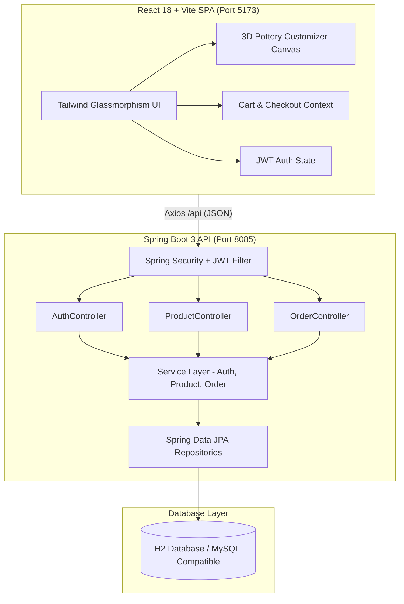

# 🏺 Local Mart — Artisan Pottery Marketplace & 3D Customizer

<p align="center">
  
</p>

<p align="center">
  <strong>An interactive e-commerce marketplace empowering local artisans and ceramic craftsmen with 3D custom pottery studio capabilities.</strong>
</p>

<p align="center">
  
  
  
  
  
  
</p>

---

## 📖 Table of Contents
- [✨ Key Features](#-key-features)
- [🏗️ System Architecture](#%EF%B8%8F-system-architecture)
- [🛠️ Tech Stack](#%EF%B8%8F-tech-stack)
- [📡 REST API Documentation](#-rest-api-documentation)
- [🔑 Demo Credentials](#-demo-credentials)
- [🚀 Quick Start & Installation](#-quick-start--installation)
  - [Prerequisites](#prerequisites)
  - [1. Backend Setup (Java Spring Boot)](#1-backend-setup-java-spring-boot)
  - [2. Frontend Setup (React + Vite)](#2-frontend-setup-react--vite)
- [🎨 Design Aesthetics](#-design-aesthetics)
- [📄 License](#-license)

---

## ✨ Key Features

### 1. 🎨 3D Interactive Pottery Customizer
- **Shape Geometry**: Switch between **Classic Amphora**, **Tapered Jug**, and **Fluted Planter** shapes with real-time SVG 3D canvas rendering.
- **Scale & Sizing**: Choose Small ($6"$), Medium ($9"$), or Large ($12"$) proportions.
- **Mineral Glaze Palette**: Select authentic kiln glazes including *Terracotta*, *Cobalt Blue*, *Sage Green*, *Golden Ochre*, and *Charcoal Black*.
- **Hand-Engraved Text**: Live preview of custom text carved into the pottery body (e.g., `"ARIA 2026"`).
- **Dynamic Pricing**: Real-time calculation based on selected dimensions, mineral glaze complexity, and custom text.

### 2. 🛍️ Artisan Product Catalog & Shopping Cart
- Search by product name, category (*Vases*, *Tableware*, *Planters*, *Cups*, *Bowls*), or glaze finish.
- Slide-over shopping cart supporting both standard shop inventory and custom studio creations.

### 3. 📦 Customer Order Tracker (Buyer Portal)
- Live order status visualizer tracking items through 4 stages:
  1. `Order Received`
  2. `Kiln Production` (In Production)
  3. `Dispatched` (Shipped)
  4. `Delivered`

### 4. 🔨 Artisan Seller Portal
- Dashboard for master craftsmen to monitor **Total Revenue**, **Active Kiln Orders**, and **Shop Inventory**.
- Product management: Add new pottery creations, edit stock levels, and delete products.
- Order fulfillment: Real-time order status update toggles (`PENDING` ➔ `IN_PRODUCTION` ➔ `SHIPPED` ➔ `DELIVERED`).

---

## 🏗️ System Architecture



---

## 🛠️ Tech Stack

### **Backend (Java Spring Boot)**
- **Language & JDK**: Java 17
- **Framework**: Spring Boot 3.2.3
- **Security**: Spring Security + JWT (`jjwt-api` 0.11.5)
- **Persistence**: Spring Data JPA + Hibernate
- **Database**: H2 (In-Memory with MySQL compatibility mode)
- **Build Tool**: Apache Maven

### **Frontend (React)**
- **Library**: React 18
- **Language**: TypeScript 5.2
- **Build Tool**: Vite 5
- **Styling**: Tailwind CSS 3.4 + Glassmorphism UI
- **Typography**: Playfair Display (Serif) & Plus Jakarta Sans
- **Icons**: Lucide React

---

## 📡 REST API Documentation

### **Authentication (`/api/auth`)**
| Method | Endpoint | Description |
| :--- | :--- | :--- |
| `POST` | `/api/auth/register` | Register a new Buyer or Artisan Seller account |
| `POST` | `/api/auth/login` | Authenticate user and receive JWT bearer token |
| `GET` | `/api/auth/me` | Fetch authenticated user profile details |

### **Products (`/api/products`)**
| Method | Endpoint | Description |
| :--- | :--- | :--- |
| `GET` | `/api/products` | Retrieve all products (Supports `?category=` & `?search=`) |
| `GET` | `/api/products/{id}` | Get product details by ID |
| `GET` | `/api/products/seller/{sellerId}` | List products created by a specific artisan |
| `POST` | `/api/products` | Publish a new pottery item |
| `DELETE` | `/api/products/{id}` | Delete a product from inventory |

### **Orders (`/api/orders`)**
| Method | Endpoint | Description |
| :--- | :--- | :--- |
| `POST` | `/api/orders` | Submit a standard or custom studio order |
| `GET` | `/api/orders` | Retrieve all platform orders |
| `GET` | `/api/orders/email/{email}` | Retrieve orders for a customer email |
| `PATCH` | `/api/orders/{id}/status` | Update order status (`PENDING`, `IN_PRODUCTION`, `SHIPPED`, `DELIVERED`) |

---

## 🔑 Demo Credentials

For instant testing, use the 1-Click demo buttons in the Sign In modal or enter:

| Account Type | Email | Password | Role & Description |
| :--- | :--- | :--- | :--- |
| **Artisan Seller** | `artisan@localmart.com` | `artisan123` | Master Artisan Raj (*Jaipur Royal Clayware*) |
| **Customer / Buyer** | `buyer@localmart.com` | `buyer123` | Aria Sharma |

---

## 🚀 Quick Start & Installation

### Prerequisites
- **JDK 17** or higher installed (`java -version`)
- **Node.js 18+** and **npm** installed (`node -v`)
- **Apache Maven** (`mvn` or Maven wrapper)

### 1. Backend Setup (Java Spring Boot)

```bash
# Navigate to backend directory
cd backend

# Compile and build with Maven
mvn clean compile

# Run the Spring Boot application (runs on port 8085)
mvn spring-boot:run
```

The Spring Boot backend will start on **`http://localhost:8085`** and automatically seed demo products and users.

### 2. Frontend Setup (React + Vite)

```bash
# Navigate to frontend directory
cd frontend

# Install Node dependencies
npm install

# Start Vite development server (runs on port 5173)
npm run dev
```

Open your browser and navigate to **`http://localhost:5173`**.

---

## 🎨 Design Aesthetics
- **Color Palette**: Deep Obsidian Warm Stone (`#0c0a09`), Terracotta Warm Rust (`#ea580c`), Amber Ochre (`#f59e0b`), Emerald Accent (`#10b981`).
- **Typography**: Dual font system featuring Playfair Display for luxury serif headings and Plus Jakarta Sans for modern clean interfaces.
- **Glassmorphism**: Backdrop blur glass cards (`backdrop-filter: blur(12px)`) with subtle amber borders.

---

## 📄 License
Distributed under the **MIT License**. See `LICENSE` for more information.

<p align="center">
  Crafted with ❤️ for Local Artisans & Craftsmen
</p>
